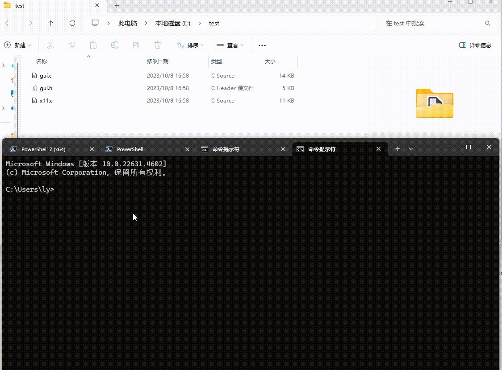

# UD Code
UD Code, powered by ollama LLM, performs automated source code analysis. It recursively traverses a given directory, reads each source code file, and queries the LLM with the code for interpretation. The generated documentation is saved as Markdown files mirroring the original file.

## Installation
On windows, run generate_sln.bat.

## Documentation
First, installation ollama, then run udcode.
```cpp
.\udcode "e:/test"
```




## Todo
Current only support the source code with file extension of ".c", ".cpp" and ".py" . Support chinese and english as the explain result.

- use chinese
```cpp
.\udcode "e:/test" 1
```

- use english
```cpp
.\udcode "e:/test" 2
```


